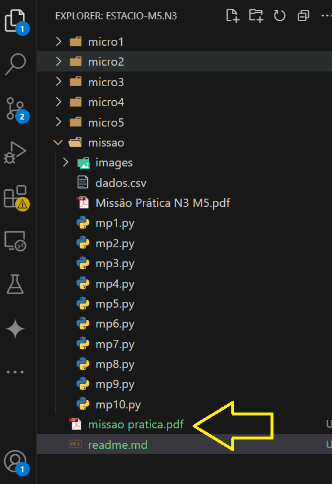

# Manipulação de Dados com Pandas - Missão Prática 3, Mundo 5

Este projeto é focado na manipulação e tratamento de dados com a biblioteca **Pandas**. O objetivo principal é o processamento de dados de um arquivo CSV, corrigindo datas, tratando valores nulos e garantindo a integridade do conjunto de dados.

## Descritivo do processo

   vide descrição no arquivo **missao pratica.pdf**

   

## Requisitos

Antes de executar o projeto, é necessário garantir que as dependências estejam instaladas e que o ambiente esteja configurado corretamente:

1. **Instalação do Python**: Certifique-se de que o Python 3.6+ esteja instalado em sua máquina. Caso não tenha, você pode instalá-lo [aqui](https://www.python.org/downloads/).

2. **Instalação das dependências**: Assegure-se de instalar as bibliotecas  

 - **`from datetime import datetime`**
   
   - **Nativo do Python**: A biblioteca `datetime` faz parte da biblioteca padrão do Python, então não é necessário instalar nada adicional para essa importação. Ela será carregada automaticamente quando você executar o código.

   - **`import pandas as pd`**
   - **Instalação necessária**: `pandas` é uma biblioteca externa para manipulação de dados e precisa ser instalada.
   - Para instalar, use o seguinte comando no terminal:
     ```bash
     pip install pandas
     ```

   - **`import numpy as np`**
   - **Instalação necessária**: `numpy` é uma biblioteca externa utilizada para computação numérica.
   - Para instalar, use o seguinte comando:
     ```bash
     pip install numpy
     ```

   - **`import sys`**
   - **Nativo do Python**: O módulo `sys` faz parte da biblioteca padrão do Python e não requer instalação adicional.

 
## Estrutura do Projeto

    Seguindo o roteiro das tarefas, foram realizadas as micro-atividades e posteriormente a missão pratica.

    A missão pratica esta na **pasta missao** 

1. **Scripts**:
    
    O código está estruturado da seguinte maneira:
     
    - Cada tarefa da missão prtatica foi isolada em um arquivo chamada 'mp1.py' e assim sucessivamente para que pudessem ser executados separadamente e seu conteudo pudesse ser analisado.

    
 
## Executando o Projeto

1. Coloque o arquivo `dados.csv` no mesmo diretório do script Python.

2. Execute o script no terminal:

   ```bash
   python nome_do_arquivo.py
   ```
  
  **obs: nome_do_arquivo = mp1.py ... mp10.py**
 
## Observações Finais

Este projeto foi desenvolvido como parte da Missão Prática Nível 3, e abrange conceitos fundamentais de manipulação de dados em Python com a biblioteca Pandas, como tratamento de valores nulos, conversão de tipos de dados e manipulação de datas.

 